<div align="center">

<!-- ================= ANIMATED INTRO ================= -->

<!-- Glitch Effect Header -->


<!-- Custom Glitch Name -->
<h1>
  
</h1>

<!-- Animated Role Tagger -->
<div style="margin-top:-20px;">
  
</div>

<!-- Pulse Status Badges -->
<div style="margin:15px 0;">
  
  
  
  
</div>

<!-- Profile Stats with Hover -->
<a href="https://github.com/TripleN-Og">
  
</a>
<a href="https://github.com/TripleN-Og?tab=followers">
  
</a>
<a href="https://github.com/TripleN-Og?tab=repositories">
  
</a>
<a href="https://github.com/TripleN-Og">
  
</a>

<br>

<!-- Animated Divider -->


</div>

<br>

<!-- ================= ABOUT ME ================= -->

<div align="center">

##  About Me

</div>

<table>
<tr>
<td width="60%" valign="top">

### 👋 Who Am I?

```typescript
const tripleN = {
  role: "Discord Bot Developer & Backend Engineer",
  location: "Building from the terminal",
  focus: ["Discord Systems", "Music Infrastructure", "Backend APIs"],
  philosophy: "Build it once, build it right, make it scale",
  currentStatus: "Shipping Components V2 interfaces",
  coffeePerDay: Infinity,
  bugsFixed: "Lost count",
  featuresShipped: "Always more"
};
```

<br>

> **"Clean code over clever code. Scalable systems over temporary solutions. Good UX over unnecessary complexity."**

<br>

### 🔥 What Drives Me
- 🎯 **Purpose-Built Systems** — Every project solves a real problem
- ⚡ **Performance First** — Fast code, fast load, fast everything
- 🏗️ **Scalable Architecture** — Build for 10 users or 10 million
- 🚀 **Ship & Iterate** — Perfect is the enemy of deployed

</td>
<td width="40%" valign="top">

### 📊 Quick Stats

<!-- GitHub Stats Card -->


<br>

<!-- Streak Stats -->


</td>
</tr>
</table>

---

<!-- ================= HOW I BUILD ================= -->

<div align="center">

## 🧭 How I Build

```mermaid
flowchart LR
    A["💡 Ideation"] -->|"Research & Plan"| B["📐 Architecture"]
    B -->|"Design Systems"| C["⚙️ Engineering"]
    C -->|"Iterate Fast"| D["🧪 Validation"]
    D -->|"Ship It"| E["🚀 Deployment"]
    E -->|"Monitor & Learn"| F["📊 Observability"]
    F -.->|"Feedback Loop"| A

    style A fill:#0D1117,stroke:#7C3AED,color:#fff,stroke-width:2px,stroke-dasharray: 5 5
    style B fill:#1a1040,stroke:#8B5CF6,color:#fff,stroke-width:2px
    style C fill:#0D1117,stroke:#5865F2,color:#fff,stroke-width:2px
    style D fill:#1a1040,stroke:#8B5CF6,color:#fff,stroke-width:2px
    style E fill:#0D1117,stroke:#7C3AED,color:#fff,stroke-width:2px
    style F fill:#1a1040,stroke:#5865F2,color:#fff,stroke-width:2px
```

</div>

<div align="center">

<!-- Interactive Flowchart -->


</div>

<br>

<!-- Animated Progress Metrics -->
<div align="center">

| Metric | Progress |
|--------|----------|
| 🏗️ System Design |  |
| ⚡ Performance Optimization |  |
| 🎨 UI/UX Engineering |  |
| 🚀 Deployment & Scaling |  |

</div>

---

<!-- ================= WHAT I BUILD ================= -->

<div align="center">

## ⚡ What I Build

</div>

<table>
<tr>
<td width="50%" valign="top">

### 🤖 Discord Systems
Complete Discord applications engineered for functionality, performance, and a clean end-user experience.

**Core Capabilities**
- 🔹 Slash Commands & Context Menus
- 🔹 Components V2 & Interactive UI
- 🔹 Moderation & Auto-mod Pipelines
- 🔹 Sharding & Cluster Management
- 🔹 Permission & Role Automation
- 🔹 Structured Logging & Webhooks

**Architecture**
```
Interaction → Handler → Service → Database
     ↓           ↓          ↓         ↓
  Gateway    Validator   Cache    Persistent
```

</td>
<td width="50%" valign="top">

### 🎵 Music Infrastructure
Modern music systems built around smooth playback and rich interaction.

**Core Capabilities**
- 🎶 Lavalink-powered Audio Streaming
- 🎶 Queue Management & Autoplay
- 🎶 Playlists & Multi-Source Support
- 🎶 Audio Filters & Synced Lyrics
- 🎶 24/7 Persistent Playback
- 🎶 Interactive Player Controls

**Architecture**
```
User → Search → Lavalink → Voice Channel
              ↓
        Multi-Source Router
    (YT/Spotify/Deezer/SC/etc)
```

</td>
</tr>
<tr>
<td width="50%" valign="top">

### 🎫 Support Systems
Ticket infrastructure built for communities and teams that need reliable support tooling.

**Core Capabilities**
- 📋 Dynamic Panels & Categories
- 👥 Staff Claim Workflow
- 📄 Transcripts & Audit Logging
- 🔐 Granular Permission System
- ⚡ Automation Triggers
- 💎 Premium Customization

**Flow**
```
User Request → Panel → Ticket Created
                         ↓
                   Staff Claims
                         ↓
                   Resolution + Transcript
```

</td>
<td width="50%" valign="top">

### ⚙️ Backend Engineering
Backend systems designed around scalability, reliability, and maintainability.

**Core Capabilities**
- 🌐 REST & Internal APIs
- 🗄️ Database Schema Design
- ⚡ Caching & Performance Tuning
- 📊 Monitoring & Alerting
- 🧩 Modular Architecture
- 🚀 Production Deployments

**Stack**
```
Client → API Gateway → Service Layer
                         ↓
                    Cache Layer
                         ↓
                    Database
```

</td>
</tr>
</table>

---

<!-- ================= FEATURED PROJECTS ================= -->

<div align="center">

## 🚀 Featured Projects

</div>

<table>
<tr>
<td width="50%" valign="top">

### 🎵 Lilly Music
**Advanced Discord Music Infrastructure**

A modern music experience built around powerful playback, queue management, playlists, autoplay, and interactive Components V2 controls.

<details>
<summary><b>📈 Key Features</b></summary>

- ✅ Multi-source search (8+ platforms)
- ✅ 13 audio filters
- ✅ Live synced lyrics
- ✅ Smart queue with duplicate detection
- ✅ Session persistence & resume
- ✅ 24/7 voice channel presence
- ✅ Interactive player controls (Components V2)
- ✅ SQLite optimized database (26 tables)
- ✅ Hybrid sharding for scalability

</details>

`Node.js` `TypeScript` `Discord.js` `Lavalink` `SQLite` `Kazagumo`

<a href="https://github.com/TripleN-Og">

</a>
<a href="#">

</a>

</td>
<td width="50%" valign="top">

### 🎫 Tixy
**Modern Discord Ticket Infrastructure**

A customizable support system designed for communities that need powerful ticket management, staff workflows, and a clean user experience.

<details>
<summary><b>📈 Key Features</b></summary>

- ✅ Dynamic ticket panels
- ✅ Staff claim system
- ✅ Transcript generation
- ✅ Audit logging
- ✅ Permission-based access
- ✅ Auto-close & archiving
- ✅ Premium customization

</details>

`Node.js` `TypeScript` `Discord.js` `MongoDB`

<a href="https://github.com/TripleN-Og">

</a>
<a href="#">

</a>

</td>
</tr>
</table>

---

<!-- ================= TECH STACK ================= -->

<div align="center">

## 🛠️ Technology Stack

</div>

<table>
<tr>
<td align="center" width="20%">
<br><b>JavaScript</b><br><sub>Core Language</sub>
</td>
<td align="center" width="20%">
<br><b>TypeScript</b><br><sub>Type Safety</sub>
</td>
<td align="center" width="20%">
<br><b>Node.js</b><br><sub>Runtime</sub>
</td>
<td align="center" width="20%">
<br><b>Discord.js</b><br><sub>Bot Framework</sub>
</td>
<td align="center" width="20%">
<br><b>Python</b><br><script>console.log("test")</script><sub>Scripting</sub>
</td>
</tr>
<tr>
<td align="center" width="20%">
<br><b>MongoDB</b><br><sub>NoSQL DB</sub>
</td>
<td align="center" width="20%">
<br><b>SQLite</b><br><sub>Local DB</sub>
</td>
<td align="center" width="20%">
<br><b>Redis</b><br><sub>Cache</sub>
</td>
<td align="center" width="20%">
<br><b>Docker</b><br><sub>Containers</sub>
</td>
<td align="center" width="20%">
<br><b>Git</b><br><sub>VCS</sub>
</td>
</tr>
</table>

---

<!-- ================= GitHub Analytics ================= -->

<div align="center">

## 📊 GitHub Analytics

</div>

<table>
<tr>
<td width="50%" align="center">

<!-- Stats Card -->


</td>
<td width="50%" align="center">

<!-- Top Languages -->


</td>
</tr>
</table>

<br>

<!-- Activity Graph -->


<br>

<!-- Contribution Snake -->


---

<!-- ================= CURRENTLY ================= -->

<div align="center">

## 🔭 Currently

</div>

<table>
<tr>
<th align="center">🏗️ Building</th>
<th align="center">📚 Learning</th>
<th align="center">🎯 Focused On</th>
<th align="center">🔮 Exploring</th>
</tr>
<tr>
<td align="center">
Components V2 interfaces<br>
Lavalink music tooling<br>
Ticket automation<br>
Backend APIs
</td>
<td align="center">
Distributed systems patterns<br>
Sharding at scale<br>
Observability tooling<br>
Advanced caching
</td>
<td align="center">
Cleaner architecture<br>
Faster, leaner code<br>
Better developer UX<br>
Production reliability
</td>
<td align="center">
WebSocket patterns<br>
Event-driven systems<br>
Microservices<br>
Edge computing
</td>
</tr>
</table>

---

<!-- ================= DEVELOPMENT PHILOSOPHY ================= -->

<div align="center">

## 💜 Development Philosophy

</div>

<table>
<tr>
<td align="center" width="25%">

### 🧹
**Clean Code**
Over clever code

</td>
<td align="center" width="25%">

### 🏗️
**Scalable Systems**
Over temporary solutions

</td>
<td align="center" width="25%">

### 👤
**Good UX**
Over unnecessary complexity

</td>
<td align="center" width="25%">

### ⚡
**Performance**
Architecture matters

</td>
</tr>
</table>

<br>

<div align="center">

> **"Ship it. Then make it better. Then ship that too."**

</div>

---

<!-- ================= CONNECT ================= -->

<div align="center">

## 🤝 Connect With Me

</div>

<div align="center">

<a href="https://github.com/TripleN-Og">

</a>
<a href="https://discord.com/users/YOUR_DISCORD_ID">

</a>
<a href="https://twitter.com/YOUR_TWITTER">

</a>
<a href="mailto:YOUR_EMAIL">

</a>

<br><br>

<!-- Animated Typing Footer -->


</div>

---

<!-- ================= FOOTER ================= -->

<div align="center">

<br>

<!-- Code Credit -->


<br><br>

<!-- Footer Wave -->


<br>

<sub>
  <b>TripleN</b> • Discord Bot Developer • Backend Engineer • Systems Builder
</sub>
<br>
<sub>
  <i>"Build it once, build it right, make it scale."</i>
</sub>

</div>
