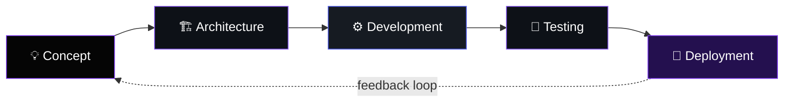

<div align="center">


<br>


<br>

<a href="https://github.com/TripleN-Og">

</a>
<a href="https://github.com/TripleN-Og?tab=followers">

</a>
<a href="https://github.com/TripleN-Og?tab=repositories">

</a>

<br><br>


</div>

<br>

<!-- ================= INTRO ================= -->

<div align="center">

# 👋 Hey, I'm **TripleN**

### Discord Bot Developer • Backend Engineer • Systems Builder

</div>

```ts
const triplen = {
  role: "Discord Bot Developer & Backend Engineer",
  focus: ["Discord systems", "music infrastructure", "backend architecture"],
  philosophy: "build it once, build it right, make it scale",
  currentlyBuilding: "Components V2 interfaces & Lavalink-powered music",
  status: "shipping something, as usual"
};
```

<div align="center">

I build **powerful Discord applications, scalable backend systems, automation tools, and modern interactive interfaces.**

### **Build better systems. Make them scalable. Make them useful.**

</div>

---

<!-- ================= WORKFLOW ================= -->

# 🧭 How I Build



---

# ⚡ What I Build

<div align="center">
<table>
<tr>

<td width="50%" valign="top">

### 🤖 Discord Systems
Complete Discord applications engineered for functionality, performance, and a clean end-user experience.

**Core work**
- Slash Commands & Context Menus
- Components V2 & Interactive UI
- Moderation & Auto-mod Pipelines
- Sharding & Cluster Management
- Permission & Role Automation
- Structured Logging

</td>

<td width="50%" valign="top">

### 🎵 Music Infrastructure
Modern music systems built around smooth playback and rich interaction.

**Core features**
- Lavalink-powered playback
- Queue management & autoplay
- Playlists & multi-source support
- Audio filters & synced lyrics
- 24/7 playback nodes
- Interactive player controls

</td>

</tr>
<tr>

<td width="50%" valign="top">

### 🎫 Support Systems
Ticket infrastructure built for communities and teams that need reliable support tooling.

**Core features**
- Dynamic panels & categories
- Staff claim workflow
- Transcripts & audit logging
- Granular permissions
- Automation triggers
- Premium customization options

</td>

<td width="50%" valign="top">

### ⚙️ Backend Engineering
Backend systems designed around scalability, reliability, and maintainability.

**Focus areas**
- REST & internal APIs
- Database schema design
- Caching & performance tuning
- Monitoring & alerting
- Modular, testable architecture
- Production-grade deployments

</td>

</tr>
</table>
</div>

---

# 🛠️ Technology Stack

<div align="center">

**Languages**
<br>


<br><br>

**Runtime & Frameworks**
<br>


<br><br>

**Databases & Infrastructure**
<br>


<br><br>

**Development Tools**
<br>


</div>

---

# 🚀 Featured Projects

<div align="center">
<table>

<tr>
<td width="50%" valign="top">

### 🎵 Lilly Music
**Advanced Discord Music Infrastructure**

A modern music experience built around powerful playback, queue management, playlists, autoplay, and interactive controls.

`Node.js` `Discord.js` `Lavalink` `MongoDB`

<a href="YOUR_LILLY_REPOSITORY_URL">

</a>

</td>

<td width="50%" valign="top">

### 🎫 Tixy
**Modern Discord Ticket Infrastructure**

A customizable support system designed for communities that need powerful ticket management and a clean user experience.

`Node.js` `Discord.js` `MongoDB`

<a href="YOUR_TIXY_REPOSITORY_URL">

</a>

</td>
</tr>

<tr>
<td width="50%" valign="top">

### 🌐 Discord Infrastructure
**Scalable Backend Systems**

Infrastructure focused on sharding, monitoring, databases, APIs, Lavalink orchestration, and reliable production deployments.

`Node.js` `MongoDB` `Sharding` `Lavalink`

</td>

<td width="50%" valign="top">

### 🧪 Experimental Projects
**Building What's Next**

Constantly experimenting with new ideas, interfaces, and backend patterns before they make it into production.

`Researching` `Building` `Testing` `Improving`

</td>
</tr>

</table>
</div>

---

# 📊 GitHub Analytics

<div align="center">


<br><br>


</div>

---

# 🏆 GitHub Achievements

<div align="center">

</div>

---

# 🐍 Contribution Activity

<div align="center">

</div>

---

# 📈 Developer Activity

<div align="center">

</div>

---

# 🔭 Currently

<div align="center">

| 🏗️ Building | 📚 Learning | 🎯 Focused On |
|:---:|:---:|:---:|
| Components V2 interfaces | Distributed systems patterns | Cleaner architecture |
| Lavalink music tooling | Sharding at scale | Faster, leaner code |
| Ticket automation | Observability tooling | Better developer UX |

</div>

---

# 💜 Development Philosophy

<div align="center">

### **Clean code over clever code.**
### **Scalable systems over temporary solutions.**
### **Good UX over unnecessary complexity.**
### **Performance matters. Architecture matters.**
### **Shipping matters more than talking.**

<br>


</div>

---

# 🎮 Discord

<div align="center">

<a href="https://discord.com">

</a>

<br><br>


</div>

---

# ☕ Support the Work

<div align="center">

If any of my projects have been useful to you or your server, consider supporting future development.

<a href="YOUR_SPONSOR_OR_KOFI_URL">

</a>

</div>

---

# 🤝 Connect With Me

<div align="center">

<a href="https://github.com/TripleN-Og">

</a>
<a href="https://discord.com">

</a>

<br><br>


<br><br>

### `CODE • CREATE • IMPROVE • REPEAT`

<br>


</div>
